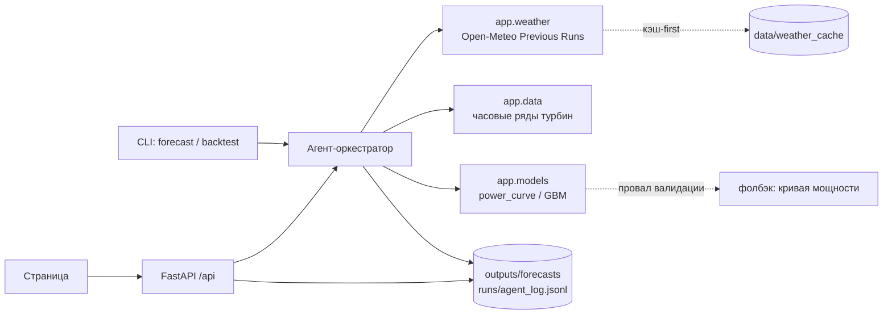

# WindCast — agentic-прогноз выработки ВЭС на 24–48 часов

Диспетчер ветропарка получает почасовой прогноз выработки на двое суток вперёд — с полосой неопределённости, обоснованием каждого шага агента и гарантией, что прогноз построен только на тех данных, которые были доступны на момент выпуска. Трек «Энергетика», кейс: «Agentic AI для прогнозирования выработки ВЭС», кейсодатель АО «Самрук-Казына» (`docs/TASK.md`).

- **Демо:** развёрнутой версии нет — запуск локально по разделу «Установка и запуск», ключи не нужны.

## Краткое описание

В Казахстане на ВЭС приходится около 82% всех дисбалансов возобновляемой генерации, а почасовое отклонение факта от заявленного графика достигает ~50% ([QazaqGreen, 2025](https://qazaqgreen.com/en/journal-qazaqgreen/industry-news/3579/)). График на сутки вперёд подаётся до 08:00, скорректировать его можно лишь за два часа — значит цена ошибки прогноза платится деньгами за дисбаланс.

WindCast закрывает этот разрыв: по координатам парка агент сам забирает архивные прогнозы погоды, приводит историю турбин к часам, считает выработку, оценивает результат и **пересчитывает прогноз, когда приходит свежий прогон погоды**.

Отличие решения — в честности к времени. Мы воспроизводим прошлое как оно было: для каждого целевого часа берётся тот прогон модели погоды, который **успел опубликоваться к моменту выпуска**, а не фактическая погода, ставшая известной позже. Правило зашито в код (`config.safe_previous_day`), проверяется тестом и **видно на графике**: полоса неопределённости окрашена по свежести использованного прогноза. Соблазн «подсмотреть будущее» здесь даёт красивые метрики и бесполезную систему, поэтому запрет сделан наблюдаемым, а не декларативным.

## Что реализовано

- **R2** — агент сам получает архивные прогнозы Open-Meteo Previous Runs по координатам парка; кэш-first, по умолчанию без сети; правило day1/day2/day3 против утечки, проверенное тестом.
- **R8** — API по контракту и одностраничный интерфейс: выбор выпуска, график 48 ч с полосой p10–p90, лента шагов агента с решениями, сводка диспетчеру, таблица метрик.
- **R6** — воспроизводимость: запуск без ключей, тесты, линтер, smoke со свежего клона.
- **R10** (частично) — второй источник погоды `gfs_seamless` загружен в кэш как фолбэк и индикатор разброса.

В работе (лид): **R1** приведение истории к часам, **R3** модели (персистентность, кривая мощности, GBM с квантилями), **R4** ретроспектива за февраль, **R5** замыкание agentic-цикла, **R7** метрики. Актуальные статусы — в таблице «Трассировка требований».

## Как работает решение

1. **Выпуск.** «Прогноз на день D» делается в D+1 00:00 по Алматы: наблюдения доступны до D 23:50, горизонт — следующие 48 часов (0–23 ч = сутки, 24–47 ч = вторые сутки).
2. **Погода.** Агент берёт из кэша (или, с `--refresh`, из Open-Meteo) архивные прогоны для координат парка и на каждый целевой час выбирает **разрешённое** поле `previous_dayN`.
3. **Подготовка.** История двух турбин с шагом 10 минут приводится к часам: локальное время Алматы → UTC, флаги дыр и простоев.
4. **Модель.** По прогнозному ветру считается выработка каждой турбины и парка, плюс квантили p10/p90 как мера неопределённости.
5. **Анализ.** Агент проверяет результат (диапазон, скачки, покрытие часов) и при провале валидации откатывается на кривую мощности, записывая решение и причину.
6. **Пересчёт.** Через 12 часов после выпуска появляются более свежие прогоны — агент перевыпускает прогноз (ревизия 1) на оставшиеся часы. На графике видно и новую кривую, и то, что она заменила.

## Технологии

| Слой | Решение |
|---|---|
| Язык | Python 3.12, менеджер зависимостей `uv` (версии зафиксированы в `uv.lock`) |
| API и страница | FastAPI 0.141, pydantic 2.13, статика без сборки — инлайновый SVG, ноль внешних запросов |
| Данные | pandas 3.0, pyarrow (parquet) |
| Модели | scikit-learn, LightGBM |
| Погода | [Open-Meteo Previous Runs API](https://open-meteo.com/en/docs/previous-runs-api), модели `best_match` и `gfs_seamless` |
| LLM (опционально) | OpenAI-совместимый клиент `openai` — только для сводки диспетчеру; без ключа работает шаблон |
| Проверки | pytest, ruff, `scripts/smoke.sh` |

## Архитектура проекта



Агент — детерминированный цикл `plan → fetch_weather → validate_weather → prepare → run_model → analyze → recompute_if_updated → write_report`. Каждый шаг пишет строку в `runs/<run_id>/agent_log.jsonl` со статусом, решением и причиной, поэтому любой вывод можно проследить до данных. API только читает результаты с диска и потому не зависит от того, чем именно был получен прогноз; страница целиком строится на этих же публичных эндпоинтах.

## Установка и запуск

### Быстрый старт (без ключей, ~2 минуты)
```bash
uv sync
uv run uvicorn app.main:app --port 8000   # http://localhost:8000
```
Откроется страница с выпуском-образцом: график, лента шагов агента и сводка. Без `LLM_API_KEY` проект работает в DEMO-режиме — прогноз считается кодом, сводка собирается шаблоном; LLM только переписывает её текст и ни на одно число не влияет.

### Установка
- Требования: Python 3.12 и [uv](https://docs.astral.sh/uv/) — или pip, или Docker
- `uv sync` (версии зафиксированы в `uv.lock`); без uv: `pip install -r requirements.txt`
- Docker: `docker build -t ctrlx . && docker run -p 8000:8000 ctrlx`
- Ключи — по желанию: `cp .env.example .env.local`

### Запуск
- API и страница: `uv run uvicorn app.main:app --port 8000` → http://localhost:8000
- Один выпуск: `uv run python -m app.cli forecast --issue 2026-01-31`
- Ретроспектива за февраль: `uv run python -m app.cli backtest --from 2026-01-31 --to 2026-02-27`
- Обучение моделей: `uv run python -m app.cli train`
- Метрики на отложенном месяце: `uv run python -m app.cli evaluate --holdout 2026-01`
- Тесты и линтер: `uv run pytest -q && uv run ruff check .`
- Перекачать прогнозы погоды (нужна сеть): добавить `--refresh`

### Зависимости
Список — `pyproject.toml` / `requirements.txt`: fastapi, uvicorn, pydantic, pandas, pyarrow, scikit-learn, lightgbm, openai, python-dotenv; разработка — pytest, httpx, ruff.

### Переменные окружения
| Переменная | Обязательна | По умолчанию | Назначение |
|---|---|---|---|
| `DEMO_MODE` | нет | `auto` | `auto` — LLM, если заданы ключ и модель; `1` — всегда без LLM |
| `LLM_API_KEY` | нет | — | ключ OpenAI или NVIDIA; без него включается DEMO-режим |
| `LLM_BASE_URL` | нет | `https://api.openai.com/v1` | для NVIDIA: `https://integrate.api.nvidia.com/v1` |
| `LLM_MODEL` | с ключом | — | имя модели |

## Как проверить решение

- **На развёрнутой версии:** развёрнутой версии нет.
- **Локально:** шаги ниже, ключи и личные аккаунты не нужны, сеть не нужна.

1. `uv sync && uv run uvicorn app.main:app --port 8000`
2. Открыть http://localhost:8000 — страница показывает выпуск, график с полосой p10–p90 и ленту шагов агента.
3. Проверить API напрямую:

```bash
curl -s http://localhost:8000/api/health
# → {"ok":true,"mode":"demo","commit":"dev"}

curl -s http://localhost:8000/api/issues
# → [{"issue_date":"2026-01-31","run_id":"…","model_name":"power_curve","revisions":2,…}]

curl -s http://localhost:8000/api/forecast/2026-01-31 | head -c 400
# → ForecastIssue: rows (почасовые строки), summary, warnings

curl -s http://localhost:8000/api/runs/20260201T0000-sample/log
# → шаги агента: tool, status, decision, reason, duration_ms
```

4. Убедиться, что утечки нет: в каждой строке прогноза поле `wx_field` (`day1`/`day2`/`day3`) показывает, насколько старый прогон погоды был разрешён на этом горизонте. Тест `tests/test_weather.py` проверяет это правило для всех строк.

### Правило против утечки данных

ТЗ требует использовать «архивные прогнозы погоды, доступные на соответствующий момент времени, а не фактические погодные значения, ставшие известными позднее». Open-Meteo отдаёт поле `previous_dayN` — прогноз от прогона, инициализированного не позднее чем за `24·N` часов до целевого часа. Прогоны публикуются с задержкой, у нас она принята равной 6 часам (`PUBLISH_DELAY_H`). Значит для выпуска в момент `t0` на целевой час с задержкой `lead` допустим прогон, для которого `init + 6 ч ≤ t0`:

| Горизонт от t0 | Разрешённое поле |
|---|---|
| 0–17 ч | `previous_day1` |
| 18–41 ч | `previous_day2` |
| 42–47 ч | `previous_day3` |

Правило реализовано в `config.safe_previous_day(lead_h, hours_since_issue)` — одной функцией, которую используют и агент, и тесты. При внутрисуточном пересчёте (`hours_since_issue = 12`) граница сдвигается, потому что к этому моменту опубликованы более свежие прогоны.

### Тесты и метрики
```bash
uv run pytest -q          # API, CLI, погода и правило утечки
uv run ruff check .       # линтер
scripts/smoke.sh          # свежий clone → install → тесты → запуск → основной сценарий
```
`scripts/smoke.sh` проверяет именно то, что лежит на GitHub: клонирует репозиторий заново, ставит зависимости, гоняет тесты и линтер, поднимает сервер и дёргает основной сценарий. Полный журнал проверок — `docs/TESTING.md`. Метрики качества появятся в `docs/METRICS.md` после бэктеста (R7).

### Трассировка требований
| R-ID | Требование | Где реализовано | Как проверить | Статус |
|---|---|---|---|---|
| R1 | История турбин → часовые ряды, флаги дыр и простоев | `app/data.py` | `uv run python -m app.cli backtest` создаёт `data/processed/hourly.parquet` | 🚧 |
| R2 | Агент сам получает архивные прогнозы, правило против утечки | `app/weather.py`, `data/weather_cache/` | `uv run pytest tests/test_weather.py -q` | ✅ |
| R3 | Модели выработки с квантилями p10/p90 | `app/models.py`, `app/train.py` | `uv run python -m app.cli train` → `models/*.pkl` | 🚧 |
| R4 | Ретроспектива: выпуск на каждый день февраля | `app/service.py` | `backtest` → `outputs/forecasts/issue_*.csv` | 🚧 |
| R5 | Agentic-цикл с анализом и пересчётом, работает без ключей | `app/agent/` | `runs/<run_id>/agent_log.jsonl` содержит `validate_weather`, `analyze`, `recompute_if_updated` | 🚧 |
| R6 | README и воспроизводимость в 3 команды без ключей | `README.md`, `scripts/smoke.sh`, `docs/TESTING.md` | `scripts/smoke.sh` → SMOKE PASS | ✅ |
| R7 | Метрики на отложенных периодах против базовых моделей | `app/evaluate.py`, `docs/METRICS.md` | `uv run python -m app.cli evaluate --holdout 2026-01` | 🚧 |
| R8 | API по контракту и страница с графиком и лентой агента | `app/api/routes.py`, `static/index.html` | `curl /api/forecast/2026-01-31`; открыть http://localhost:8000 | ✅ |
| R9 | LLM-планировщик и сводка диспетчеру | `app/llm.py`, `app/agent/` | `forecast --llm` при `LLM_API_KEY` | 🚧 |
| R10 | Второй источник погоды: разброс и фолбэк | `app/weather.py`, `data/weather_cache/` | поле `wx_model` в CSV, решение в логе | 🚧 |

## Данные и интеграции

**Из ТЗ.** Две турбины в Алматинской области, ~300 м друг от друга (одна ячейка погодной сетки): турбина 1 — 43.645150, 78.535604; турбина 2 — 43.643198, 78.538828. Период 11.03.2023 00:00 – 31.01.2026 23:50, шаг 10 минут; февраля 2026 в данных нет. Колонки: время (локальное, Алматы), средняя скорость ветра м/с, нормализованная активная мощность 0…1, средняя температура °C.

| Файл | Размер | SHA-256 |
|---|---|---|
| `data/raw/turbine1.csv` | 5,9 МБ | `d82def7e56c0a1eed3f2f68eb29fd66e4299999921c9703720a880a5cf7d6703` |
| `data/raw/turbine2.csv` | 6,2 МБ | `16a844db949562290c96a86efa20178a71540ff6252275c003db4715edb9434a` |

**Открытые источники.** Прогнозы погоды — [Open-Meteo Previous Runs API](https://open-meteo.com/en/docs/previous-runs-api), бесплатно для некоммерческого использования, атрибуция CC BY 4.0. Архив загружен в `data/weather_cache/` вместе с `meta.json` (URL запроса, время загрузки, SHA-256), поэтому результат воспроизводится без сети и без ключей.

**Персональные данные.** В задаче их нет: данные телеметрии турбин не содержат сведений о людях. В LLM уходит только агрегированная сводка по выработке, без исходных рядов.

## Ограничения

- **Прогноз ветра — главный источник ошибки.** Модель выработки работает на прогнозном ветре, поэтому её точность ограничена точностью NWP, особенно на горизонте 42–47 часов, где по правилу утечки доступен только трёхсуточный прогон.
- **Две турбины, а не парк.** Данных о составе парка, кривой мощности производителя и ограничениях сети нет, поэтому «выработка парка» — среднее по двум турбинам, нормализованное к 1.
- **Простои неотличимы от штиля по причине.** Мы помечаем часы с нулевой мощностью при ветре выше 5 м/с как простой, но причину (ремонт, ограничение сети) данные не содержат.
- **Задержка публикации прогонов принята равной 6 часам** — консервативная оценка, точное расписание Open-Meteo не документировано; она сдвигает правило в сторону более старых, а значит более безопасных прогнозов.
- **Февраль 2026 проверяется только по прогнозу.** Фактической выработки за тестовый период в данных нет, поэтому качество измеряется на отложенных периодах (январь 2026, февраль 2025).
- **Куда развивать:** добавить ансамбль из нескольких моделей NWP и сетку точек вокруг парка (замер на наших данных дал MAE 0.229 → 0.180), учитывать направление ветра и стратификацию, подключить факт по SCADA для дообучения и калибровки квантилей.

## Ссылка на развёрнутую версию

Развёрнутой версии нет — запуск локально по разделу «Установка и запуск», ключи и аккаунты не нужны.

## Команда
| Участник | Роль | Вклад |
|---|---|---|
| Мустафа | лид-интегратор | контракт и зоны, данные и часовые ряды, модели, agentic-оркестратор, ретроспектива, метрики |
| Амирхан | данные погоды и идеи | Open-Meteo Previous Runs, кэш и правило против утечки, ресерч по ансамблю NWP |
| Ансар | платформа | API по контракту, страница, README, тесты API/CLI, smoke |

## Как мы работали с AI-агентами
- **Направляющие:** `AGENTS.md` и `CLAUDE.md` — правила, контракт, зоны ответственности; скиллы в `.agents/skills/` — разбор ТЗ, checkpoint, критики, сдача, UI.
- **Сенсоры:** автотесты, линтер, smoke-тест со свежего клона (`scripts/smoke.sh`), проверка секретов и зон в pre-commit, критики со свежим контекстом, независимый прогон по README (`scripts/judge.sh`). Журнал — `docs/TESTING.md`.
- Трое разработчиков, у каждого свой агент (Claude Code или Codex), один `main`, результат каждый час — `docs/PROGRESS.md`. Сообщения между агентами — отдельная ветка `team-chat` (`scripts/msg.sh`).

## Заранее подготовленное, заимствования и AI-инструменты
- Подготовлено до старта (п. 5.4.4.2): см. `docs/PREPARED.md` — инструменты разработки и пустой каркас без логики задачи.
- Заимствования: данные турбин — из ТЗ кейсодателя; прогнозы погоды — Open-Meteo Previous Runs API (CC BY 4.0). Сторонний код не заимствовался.
- AI-инструменты разработки: Claude Code, OpenAI Codex.
