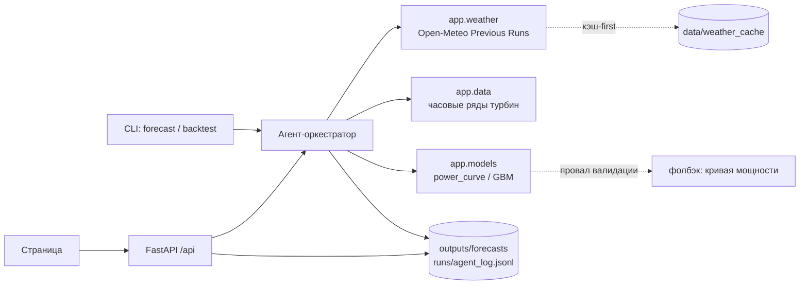

# WindCast — agentic-прогноз выработки ВЭС на 24–48 часов

Диспетчер ветропарка получает почасовой прогноз выработки на двое суток вперёд — с полосой неопределённости, обоснованием каждого шага агента и гарантией, что прогноз построен только на тех данных, которые были доступны на момент выпуска. Трек «Энергетика», кейс: «Agentic AI для прогнозирования выработки ВЭС», кейсодатель АО «Самрук-Казына» (`docs/TASK.md`).

- **Демо:** развёрнутой версии нет — запуск локально по разделу «Установка и запуск», ключи не нужны.

## Краткое описание

В Казахстане на ВЭС приходится около 82% всех дисбалансов возобновляемой генерации, а почасовое отклонение факта от заявленного графика достигает ~50% ([QazaqGreen, 2025](https://qazaqgreen.com/en/journal-qazaqgreen/industry-news/3579/)). График на сутки вперёд подаётся до 08:00, скорректировать его можно лишь за два часа — значит цена ошибки прогноза платится деньгами за дисбаланс.

WindCast закрывает этот разрыв: по координатам парка агент сам забирает архивные прогнозы погоды, приводит историю турбин к часам, считает выработку, оценивает результат и **пересчитывает прогноз, когда приходит свежий прогон погоды**.

Объект кейса — вся ВЭС **«Нурлы»** 5 МВт (2 × Goldwind GW109/2500, ТОО «Samruk-Green Energy», дочка «Самрук-Энерго»): координаты из ТЗ совпадают с турбинами в OpenStreetMap с точностью до 10 м. Выпуск делается в полночь по итогам дня D; его вторые сутки (D+2) — готовый черновик суточной заявки, которую ВИЭ подаёт до 08:00 D+1, а пересчёт в 12:00 — внутрисуточная корректировка не позже чем за 2 часа до часа (Правила оптового рынка, п. 51, 97–99). Точность на январе 2026: nMAE 15,4 % против 30,7 % у наивного прогноза. Полное описание решения, архитектуры и источников — `docs/SOLUTION.md`.

Отличие решения — в честности к времени. Мы воспроизводим прошлое как оно было: для каждого целевого часа берётся тот прогон модели погоды, который **успел опубликоваться к моменту выпуска**, а не фактическая погода, ставшая известной позже. Правило зашито в код (`config.safe_previous_day`), проверяется тестом и **видно на графике**: полоса неопределённости окрашена по свежести использованного прогноза. Соблазн «подсмотреть будущее» здесь даёт красивые метрики и бесполезную систему, поэтому запрет сделан наблюдаемым, а не декларативным.

## Что реализовано

- **R1** — история двух турбин с шагом 10 минут приведена к часам: время SCADA (фиксированный UTC+5) → UTC, флаги дыр и простоев.
- **R2** — агент сам получает архивные прогнозы Open-Meteo Previous Runs по координатам парка; кэш-first, по умолчанию без сети; правило day1/day2/day3 против утечки, проверенное тестом.
- **R3** — три модели: кривая мощности (MOS), градиентный бустинг с квантилями p10/p90 и конформной калибровкой, климатология как последний рубеж.
- **R4** — ретроспектива: 28 выпусков за тестовый период, по 48 часов каждый.
- **R5** — agentic-цикл замкнут, и **вклад агентского слоя измерен** — раздел «Как проверить агентность».
- **R6** — воспроизводимость: запуск без ключей и без сети, тесты, линтер, smoke со свежего клона.
- **R7** — метрики на отложенных периодах: январь 2026 nMAE 15,4 %, февраль 2025 — 17,8 % (таблица ниже).
- **R8** — API по контракту и одностраничный интерфейс: выбор выпуска, график 48 ч с полосой p10–p90, лента шагов агента, сводка диспетчеру, таблица метрик.
- **R10** — второй источник погоды `gfs_seamless`: переключение при провале валидации доказано в `outputs/evidence/faults.json`.

Частично: **R9** — сводку диспетчеру может переписывать LLM (OpenAI или NVIDIA, второй провайдер — запасной); каждое число в тексте LLM сверяется с фактами выпуска, иначе остаётся шаблон. Без ключа работает шаблон. Статусы по каждому требованию — в таблице «Трассировка требований».

## Как работает решение

1. **Выпуск.** «Прогноз на день D» делается в D+1 00:00 по Алматы: наблюдения доступны до D 23:50, горизонт — следующие 48 часов (0–23 ч — текущие сутки D+1, 24–47 ч — сутки D+2, черновик заявки до 08:00).
2. **Погода.** Агент берёт из кэша (или, с `--refresh`, из Open-Meteo) архивные прогоны для координат парка и на каждый целевой час выбирает **разрешённое** поле `previous_dayN`.
3. **Подготовка.** История двух турбин с шагом 10 минут приводится к часам: время SCADA (UTC+5) → UTC, флаги дыр и простоев; признаки из прогноза погоды на 48 часов.
4. **Модель.** По прогнозному ветру считается выработка каждой турбины и парка, плюс квантили p10/p90 как мера неопределённости.
5. **Анализ.** Агент проверяет результат (диапазон, скачки, покрытие часов) и при провале спускается по лестнице фолбэков: другой источник погоды → кривая мощности → климатология, записывая решение и причину.
6. **Пересчёт.** Через 12 часов после выпуска появляются более свежие прогоны — агент перевыпускает прогноз (ревизия 1) на часы, которые ещё разрешено корректировать (не раньше чем через 2 ч). На графике видно и новую кривую, и то, что она заменила.
7. **Самопроверка.** Агент сравнивает свои опубликованные выпуски с фактом, когда он появляется, и поднимает флаг дрейфа с рекомендацией переобучения; модель молча не меняется. В тестовом феврале факта нет — агент честно пишет, что память заморожена на 31.01.

## Технологии

| Слой | Решение |
|---|---|
| Язык | Python 3.12, менеджер зависимостей `uv` (версии зафиксированы в `uv.lock`) |
| API и страница | FastAPI 0.141, pydantic 2.13, статика без сборки — инлайновый SVG, ноль внешних запросов |
| Данные | pandas 3.0, pyarrow (parquet) |
| Модели | scikit-learn (`HistGradientBoostingRegressor`, квантильная потеря + CQR) — намеренно без нативных зависимостей: LightGBM требует системный OpenMP, которого нет в lock-файле |
| Погода | [Open-Meteo Previous Runs API](https://open-meteo.com/en/docs/previous-runs-api), модели `best_match` и `gfs_seamless` |
| LLM (опционально) | OpenAI-совместимый клиент `openai` — только для сводки диспетчеру; без ключа работает шаблон |
| Проверки | pytest, ruff, `scripts/smoke.sh` |

## Архитектура проекта



Агент — детерминированный цикл `plan → fetch_weather → validate_weather → prepare → run_model → analyze → recompute_if_updated → write_report`. Каждый шаг пишет строку в `runs/<run_id>/agent_log.jsonl` со статусом, решением и причиной, поэтому любой вывод можно проследить до данных. API только читает результаты с диска и потому не зависит от того, чем именно был получен прогноз; страница целиком строится на этих же публичных эндпоинтах.

## Установка и запуск

### Быстрый старт (без ключей и без сети, ~2 минуты)
```bash
uv sync
uv run python -m app.cli backtest          # 28 выпусков 31.01–27.02 заново, ~5 с
uv run uvicorn app.main:app --port 8000    # http://localhost:8000
```
Откроются 28 выпусков февраля 2026, посчитанные агентом: график, лента шагов агента, сводка диспетчеру, точность и доказательства агентности. Готовые результаты уже лежат в репозитории (`outputs/`, `runs/`), вторая команда пересчитывает их и даёт побайтно те же CSV. Без `LLM_API_KEY` проект работает в DEMO-режиме — прогноз считается кодом, сводка собирается шаблоном; LLM только переписывает её текст и ни на одно число не влияет.

### Установка
- Требования: Python 3.12 и [uv](https://docs.astral.sh/uv/) — или pip, или Docker
- `uv sync` (версии зафиксированы в `uv.lock`); без uv: `pip install -r requirements.txt`
- Docker: `docker build -t ctrlx . && docker run -p 8000:8000 ctrlx`
- Ключи — по желанию: `cp .env.example .env.local`

### Запуск
- API и страница: `uv run uvicorn app.main:app --port 8000` → http://localhost:8000
- Один выпуск: `uv run python -m app.cli forecast --issue 2026-01-31`
- Ретроспектива за февраль: `uv run python -m app.cli backtest --from 2026-01-31 --to 2026-02-27`
- Обучение моделей: `uv run python -m app.cli train`
- Метрики на отложенном месяце: `uv run python -m app.cli evaluate --holdout 2026-01`
- Тесты и линтер: `uv run pytest -q && uv run ruff check .`
- Перекачать прогнозы погоды (нужна сеть): добавить `--refresh`

### Зависимости
Список — `pyproject.toml` / `requirements.txt`: fastapi, uvicorn, pydantic, pandas, pyarrow, scikit-learn, openai, python-dotenv; разработка — pytest, httpx, ruff.

### Переменные окружения
| Переменная | Обязательна | По умолчанию | Назначение |
|---|---|---|---|
| `DEMO_MODE` | нет | `auto` | `auto` — LLM, если заданы ключ и модель; `1` — всегда без LLM |
| `LLM_API_KEY` | нет | — | ключ OpenAI или NVIDIA; без него включается DEMO-режим |
| `LLM_BASE_URL` | нет | `https://api.openai.com/v1` | для NVIDIA: `https://integrate.api.nvidia.com/v1` |
| `LLM_MODEL` | с ключом | — | имя модели |
| `LLM_FALLBACK_API_KEY`, `LLM_FALLBACK_BASE_URL`, `LLM_FALLBACK_MODEL` | нет | — | второй провайдер: вызывается, если первый не ответил |

## Как проверить решение

- **На развёрнутой версии:** развёрнутой версии нет.
- **Локально:** шаги ниже, ключи и личные аккаунты не нужны, сеть не нужна.

1. `uv sync && uv run uvicorn app.main:app --port 8000`
2. Открыть http://localhost:8000 — страница показывает выпуск, график с полосой p10–p90 и ленту шагов агента.
3. Проверить API напрямую:

```bash
curl -s http://localhost:8000/api/health
# → {"ok":true,"mode":"demo","commit":"dev"}

curl -s http://localhost:8000/api/issues
# → [{"issue_date":"2026-01-31","run_id":"20260201T0000-…","model_name":"gbm","revisions":2,…}]

curl -s http://localhost:8000/api/forecast/2026-01-31 | head -c 400
# → ForecastIssue: rows (почасовые строки), summary, warnings

# run_id берём из ответа выше, а не из этой инструкции: он меняется при перегенерации
run=$(curl -s http://localhost:8000/api/issues | python3 -c 'import json,sys; print(json.load(sys.stdin)[0]["run_id"])')
curl -s "http://localhost:8000/api/runs/$run/log"
# → шаги агента: tool, status, decision, reason, duration_ms
```

4. Убедиться, что утечки нет: в каждой строке прогноза поле `wx_field` (`day1`/`day2`/`day3`) показывает, насколько старый прогон погоды был разрешён на этом горизонте; в журнале агента шаг `validate_weather` пишет, за сколько часов до выпуска стал доступен самый свежий использованный прогон. Тесты `tests/test_weather.py` и `tests/test_agent.py` проверяют правило на каждой строке, а «отравленный» тест подменяет всё будущее мусором и требует побайтно тот же прогноз.

### Результат за февраль 2026

Главный файл для сравнения с фактом — `outputs/forecasts/february_2026.csv`: 672 строки, по одной на каждый час 01–28.02.2026.

| Колонка | Смысл |
|---|---|
| `target_time_utc`, `target_time_local` | час прогноза (UTC и Алматы, UTC+5) |
| `power_farm_plan`, `power_t1_plan`, `power_t2_plan` | последний прогноз на этот час: опережение 0–23 ч из выпуска, сделанного в начале этих суток, с ревизией 1 после пересчёта в 12:00 |
| `p10_plan`, `p90_plan` | коридор неопределённости p10–p90 |
| `plan_revision`, `plan_run_id` | какая ревизия и какой прогон агента дали значение (журнал — `runs/<run_id>/`) |
| `power_farm_bid`, `bid_mw` | суточная заявка: опережение 24–47 ч из выпуска предыдущей ночи, готова до 08:00; для 01.02 пусто — её делал бы выпуск за 30.01, который не входит в тестовый период |
| `plan_mw` | план в МВт (номинал ВЭС «Нурлы» 5 МВт) |

Мощность — доля номинала 0…1, как в данных кейса. Полная история каждого выпуска и ревизии — `outputs/forecasts/issue_YYYY-MM-DD.csv`; черновик заявки на D+2 в МВт·ч по часам — `runs/<run_id>/bid_YYYY-MM-DD.csv`.

**Живая сверка.** `uv run python -m app.cli forecast --issue 2026-02-10 --refresh` — агент сам запрашивает у Open-Meteo окно выпуска по координатам обеих турбин и сверяет с архивом из репозитория; пример в `runs/live_check/`: ответ API совпал с архивом на всех 48 часах (`live_match`).

### Правило против утечки данных

ТЗ требует использовать «архивные прогнозы погоды, доступные на соответствующий момент времени, а не фактические погодные значения, ставшие известными позднее». Open-Meteo отдаёт поле `previous_dayN` — значение, предсказанное за `24·N` часов до целевого часа (по документации, по исходному коду Open-Meteo и по сверке с Single Runs API). Прогон появляется в Open-Meteo с задержкой: для ECMWF IFS мы измерили 7,0 ч, для GFS 5,5–6,5 ч, для ICON 3,8 ч. Принята задержка **7 часов** (`PUBLISH_DELAY_H`): прогон допустим, если `init + 7 ч ≤ t0`.

| Горизонт от t0 | Разрешённое поле |
|---|---|
| 0–16 ч | `previous_day1` |
| 17–40 ч | `previous_day2` |
| 41–47 ч | `previous_day3` |

При пересчёте в t0 + 12 ч (ревизия 1) граница сдвигается на 12 часов: 0–28 ч → `previous_day1`, 29–47 ч → `previous_day2`. Поэтому строка ревизии 1 с опережением 28 ч и полем `day1` — не утечка: к 12:00 этот прогон уже опубликован.

Правило реализовано в `config.safe_previous_day(lead_h, hours_since_issue)` — одной функцией, которую используют обучение, агент и тесты. Если нужного поля нет, берётся только более старый прогон, никогда не более свежий. При внутрисуточном пересчёте (`hours_since_issue = 12`) граница сдвигается, потому что к этому моменту опубликованы более свежие прогоны. Реанализ (ERA5), Historical Forecast API и поле без суффикса не используются нигде.

### Как проверить агентность

«Агент» легко заявить и трудно доказать. Поэтому вклад агентского слоя **измерен**: мы прогоняем один и тот же месяц четырьмя вариантами, от простейшего к полному, и сравниваем с фактом.

```bash
uv run python -m app.cli replay --month 2026-01   # → outputs/evidence/replay_2026-01.json
uv run python -m app.cli faults                   # → outputs/evidence/faults.json
```

**Абляция** — январь 2026, 31 выпуск, 1 464 оценённых часа, обучение закончено до начала месяца:

| Вариант | MAE |
|---|---|
| A — персистентность (среднее за последние 24 ч) | 0,3066 |
| B — фиксированный пайплайн: кривая мощности, без проверок и пересчёта | 0,1948 |
| C — только модель: бустинг в момент t0, без пересчёта | 0,1535 |
| D — агент, опубликованный план: сутки D+1 с пересчётом в 12:00, заявка D+2 из выпуска (до 08:00 пересчитывать уже нельзя) | **0,1515** |

Видно, где сколько выигрыша: главный вклад даёт модель (B → C), а агентский слой добавляет сверху ещё немного (C → D). Мы не выдаём второе за первое.

**Журнал решений** — каждое решение агента с доверительным интервалом, а не «стало лучше»:

| Решение | Сработало | Δ MAE | 95% ДИ | Выигрышей |
|---|---|---|---|---|
| основная модель против запасной (C против B) — проектный выбор, агент оставил бустинг во всех выпусках | 31 из 31 | −0,0419 | [−0,0578; −0,0261] | 23 |
| пересчёт в t0+12 ч по свежим прогонам | 31 из 31 | −0,0053 | [−0,0139; +0,0027] | 19 |
| фолбэк на простую модель после провала проверки | 0 | — | — | — |
| смена источника погоды после провала валидации | 0 | — | — | — |

Отрицательная Δ означает, что решение уменьшило ошибку. Честно отмечаем: доверительный интервал пересчёта **пересекает ноль** — на спокойном январе выигрыш не доказан, а два защитных решения в нормальном режиме не срабатывали ни разу. Их ценность проверяется отдельно.

**Устойчивость к сбоям** — `app.cli faults` ломает входные данные и сравнивает агента с фиксированным пайплайном на выпуске 09.02.2026:

| Сбой | Агент | Фиксированный пайплайн |
|---|---|---|
| в основном источнике нет 6 часов ветра | 48 ч, переключился на `gfs_seamless` | 42 ч |
| выброс 100 м/с во всех прогонах основного источника | 48 ч, переключился на `gfs_seamless` | 48 ч, но **6 часов посчитаны по битому входу** |
| выброс 100 м/с только в самом свежем прогоне | 48 ч, взял более старый прогон того же источника (`older_run`), модель осталась основной | 48 ч, но **6 часов посчитаны по битому входу** |
| основной источник недоступен | 48 ч, переключился на `gfs_seamless` | **0 ч** |
| оба источника сломаны | 48 ч, перешёл на климатологию | 42 ч |

Агент выдал полный горизонт в **5 случаях из 5** и в каждом записал решение и причину в `runs/<run_id>/agent_log.jsonl`. Фиксированный пайплайн либо теряет часы, либо — что хуже — молча считает прогноз по испорченному входу.

### Тесты и метрики
```bash
uv run pytest -q          # API, CLI, погода и правило утечки
uv run ruff check .       # линтер
scripts/smoke.sh          # свежий clone → install → тесты → запуск → основной сценарий
```
`scripts/smoke.sh` проверяет именно то, что лежит на GitHub: клонирует репозиторий заново, ставит зависимости, гоняет тесты и линтер, поднимает сервер и дёргает основной сценарий. Полный журнал проверок — `docs/TESTING.md`.

**Точность на отложенных месяцах** (`uv run python -m app.cli evaluate --holdout 2026-01`, модель обучена строго до начала месяца; MAE в долях номинала, nMAE = MAE × 100 %):

| Модель | Январь 2026 | Февраль 2025 |
|---|---|---|
| Персистентность (среднее 24 ч до выпуска) | 0,307 | 0,339 |
| Климатология (месяц × час) | 0,304 | 0,327 |
| Кривая мощности по прогнозному ветру | 0,195 | 0,207 |
| **Градиентный бустинг (медиана)** | **0,154** | **0,178** |

Коридор p10–p90 после конформной калибровки покрывает 84,0 % и 84,1 % часов при цели 80 %. Результаты — `outputs/metrics/holdout_2026-01.json` и `holdout_2025-02.json`.

**Во что точность превращается в деньгах.** Каждый час, где факт вышел за коридор ±5 % от заявки, оплачивается как дисбаланс. Верхняя оценка платы за месяц по часам суточной заявки (опережение 24–47 ч) для ВЭС 5 МВт при 22,68 ₸/кВт·ч, режим договоров с 13.04.2025 (для старых договоров РФЦ коэффициенты равны 1, режим договора «Нурлы» по открытым данным не установлен):

| Модель | Январь 2026 | Февраль 2025 |
|---|---|---|
| Персистентность | 7,44 млн ₸ | 7,81 млн ₸ |
| Кривая мощности | 5,07 млн ₸ | 4,49 млн ₸ |
| **Градиентный бустинг** | **3,86 млн ₸** | **3,85 млн ₸** |
| **Экономия против персистентности** | **3,58 млн ₸** | **3,96 млн ₸** |

Это верхняя оценка, а не обещание выручки: штраф считается по каждому кВт·ч вне коридора и не учитывает взаимозачёт отклонений на рынке. Цифры берутся из `extras.imbalance_cost_upper_bound_mln_tg` в тех же файлах метрик и показаны на странице под таблицей точности.

### Трассировка требований
| R-ID | Требование | Где реализовано | Как проверить | Статус |
|---|---|---|---|---|
| R1 | История турбин → часовые ряды, флаги дыр и простоев | `app/data.py` | `data/processed/hourly.parquet` создан (964 КБ) | ✅ |
| R2 | Агент сам получает архивные прогнозы, правило против утечки | `app/weather.py`, `data/weather_cache/` | `uv run pytest tests/test_weather.py -q` | ✅ |
| R3 | Модели выработки с квантилями p10/p90 | `app/models.py`, `app/train.py` | `models/windcast.pkl` (4,5 МБ); кривая мощности, бустинг + CQR, климатология | ✅ |
| R4 | Ретроспектива: выпуск на каждый день февраля | `app/service.py` | 28 файлов `outputs/forecasts/issue_*.csv` + `february_2026.csv` | ✅ |
| R5 | Agentic-цикл с анализом и пересчётом, работает без ключей | `app/agent/` | 28 прогонов в `runs/`; вклад слоя измерен — раздел «Как проверить агентность» | ✅ |
| R6 | README и воспроизводимость в 3 команды без ключей | `README.md`, `scripts/smoke.sh`, `docs/TESTING.md` | `scripts/smoke.sh` → SMOKE PASS | ✅ |
| R7 | Метрики на отложенных периодах против базовых моделей | `app/evaluate.py` | `outputs/metrics/holdout_2026-01.json` (nMAE 15,4 %) и `holdout_2025-02.json` (17,8 %) | ✅ |
| R8 | API по контракту и страница с графиком и лентой агента | `app/api/routes.py`, `static/index.html` | `curl /api/forecast/2026-01-31`; открыть http://localhost:8000 | ✅ |
| R9 | Сводка диспетчеру от LLM с проверкой чисел | `app/llm.py`, `app/agent/orchestrator.py` | `forecast --issue 2026-02-01 --llm --demo-dir runs/llm_demo` при `LLM_API_KEY` | 🚧 |
| R10 | Второй источник погоды: разброс и фолбэк | `app/weather.py` | `gfs_seamless` в кэше; переключение доказано в `outputs/evidence/faults.json` (3 из 4 сбоев) | ✅ |

## Данные и интеграции

**Из ТЗ.** Две турбины в Алматинской области, ~300 м друг от друга (одна ячейка погодной сетки): турбина 1 — 43.645150, 78.535604; турбина 2 — 43.643198, 78.538828. Это вся ВЭС «Нурлы» 5 МВт (OpenStreetMap relation 14072944). Период 11.03.2023 00:00 – 31.01.2026 23:50, шаг 10 минут; февраля 2026 в данных нет. Колонки: время (часы SCADA, фиксированный UTC+5: 01.03.2024 они не переводились — фаза суточного хода температуры сдвинулась на 6 минут, а не на 60), средняя скорость ветра м/с, нормализованная активная мощность 0…1, средняя температура °C.

SHA-256 файлов в репозитории (переводы строк LF, как их отдаёт `git clone`); у оригиналов с Google Drive (CRLF) суммы `c4c341582fb2dd348b7187f0128cff265fe055f469413871ebb5db50eef58b5b` и `820578cd18bb557cd30c2e102f3ae5a386dfc6c489a5a15743339c2b017305e5`, данные те же.

| Файл | Размер | SHA-256 |
|---|---|---|
| `data/raw/turbine1.csv` | 5,9 МБ | `d82def7e56c0a1eed3f2f68eb29fd66e4299999921c9703720a880a5cf7d6703` |
| `data/raw/turbine2.csv` | 6,2 МБ | `16a844db949562290c96a86efa20178a71540ff6252275c003db4715edb9434a` |

**Открытые источники.** Прогнозы погоды — [Open-Meteo Previous Runs API](https://open-meteo.com/en/docs/previous-runs-api), бесплатно для некоммерческого использования, атрибуция CC BY 4.0. Архив загружен в `data/weather_cache/` вместе с `meta.json` (URL запроса, время загрузки, SHA-256), поэтому результат воспроизводится без сети и без ключей.

**Персональные данные.** В задаче их нет: данные телеметрии турбин не содержат сведений о людях. В LLM уходит только агрегированная сводка по выработке, без исходных рядов.

## Ограничения

- **Прогноз ветра — главный источник ошибки.** Модель выработки работает на прогнозном ветре, поэтому её точность ограничена точностью NWP, особенно на горизонте 42–47 часов, где по правилу утечки доступен только трёхсуточный прогон.
- **Станция из двух турбин.** Это вся ВЭС «Нурлы»; кривой мощности производителя и данных об ограничениях сети нет, поэтому «выработка станции» — среднее по двум турбинам, нормализованное к 1 (× 5 МВт в сводке).
- **Простои неотличимы от штиля по причине.** Мы помечаем часы с нулевой мощностью при ветре выше 5 м/с как простой, но причину (ремонт, ограничение сети) данные не содержат.
- **Задержка публикации прогонов принята равной 7 часам** — измерена для ECMWF IFS по `meta.json` Open-Meteo (7,0 ч); у других моделей она меньше, значит правило консервативное. Точные времена инициализации дал бы Single Runs API — это следующий шаг.
- **Источник `best_match` сменился 01.10.2025** (ICON → ECMWF IFS, у IFS ветер в среднем на 1,35 м/с ниже). Модель видит это через признак эпохи, агент пишет источник в журнал.
- **Февраль 2026 проверяется только по прогнозу.** Фактической выработки за тестовый период в данных нет, поэтому качество измеряется на отложенных периодах (январь 2026, февраль 2025).
- **Куда развивать:** добавить ансамбль из нескольких моделей NWP и сетку точек вокруг парка (замер на наших данных дал MAE 0.229 → 0.180), учитывать направление ветра и стратификацию, подключить факт по SCADA для дообучения и калибровки квантилей.

## Ссылка на развёрнутую версию

Развёрнутой версии нет — запуск локально по разделу «Установка и запуск», ключи и аккаунты не нужны.

## Команда
| Участник | Роль | Вклад |
|---|---|---|
| Мустафа | лид-интегратор | контракт и зоны, данные и часовые ряды, модели, agentic-оркестратор, ретроспектива, метрики |
| Амирхан | данные погоды и идеи | Open-Meteo Previous Runs, кэш и правило против утечки, ресерч по ансамблю NWP |
| Ансар | платформа | API по контракту, страница, README, тесты API/CLI, smoke |

## Как мы работали с AI-агентами
- **Направляющие:** `AGENTS.md` и `CLAUDE.md` — правила, контракт, зоны ответственности; скиллы в `.agents/skills/` — разбор ТЗ, checkpoint, критики, сдача, UI.
- **Сенсоры:** автотесты, линтер, smoke-тест со свежего клона (`scripts/smoke.sh`), проверка секретов и зон в pre-commit, критики со свежим контекстом, независимый прогон по README (`scripts/judge.sh`). Журнал — `docs/TESTING.md`.
- Трое разработчиков, у каждого свой агент (Claude Code или Codex), один `main`, результат каждый час — `docs/PROGRESS.md`. Сообщения между агентами — отдельная ветка `team-chat` (`scripts/msg.sh`).

## Заранее подготовленное, заимствования и AI-инструменты
- Подготовлено до старта (п. 5.4.4.2): см. `docs/PREPARED.md` — инструменты разработки и пустой каркас без логики задачи.
- Заимствования: данные турбин — из ТЗ кейсодателя; прогнозы погоды — Open-Meteo Previous Runs API (CC BY 4.0). Сторонний код не заимствовался.
- AI-инструменты разработки: Claude Code, OpenAI Codex.
