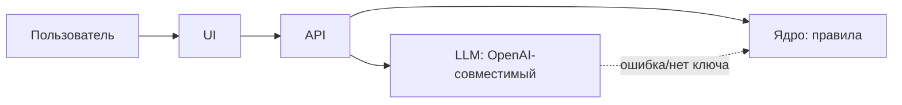

# <Название проекта>

<!-- /ship заполняет каждый раздел и удаляет все подсказки <!-- -->. Разделы от «Краткое описание» до «Ссылка на развёрнутую версию» — порядок и названия из инструкции организаторов для README: не переставлять и не переименовывать. Писать только то, что подтверждается репозиторием. -->

<Одна фраза: кому и какую проблему решаем.> Трек «Финансы», кейс: <название кейса> (`docs/TASK.md`).

- **Демо:** <https://… .vercel.app — открывается без логина>

## Краткое описание
<Какую проблему решает проект и для кого: боль партнёра в цифрах из ТЗ → что делает решение → почему так. Одна «вау»-идея — здесь.>

## Что реализовано
<Основные функции и возможности списком, у каждой — R-ID из «Трассировки требований». Только то, что работает в репо.>

## Как работает решение
<Основной пользовательский сценарий от входных данных до результата, 3–6 шагов.>

## Технологии
<Языки, фреймворки, библиотеки, AI-модели, API и внешние сервисы — с версиями.>

## Архитектура проекта

<2–4 предложения: основные компоненты и как они взаимодействуют.>

## Установка и запуск

### Быстрый старт (без ключей, ~2 минуты)
```bash
# ≤ 3 команды, копируются как есть
```
Без `LLM_API_KEY` проект работает в DEMO-режиме: <что именно даёт rule-based путь>.

### Установка
- Требования: <Node 22 + pnpm | Python 3.12 + uv>, macOS/Linux/Windows
- <Шаги установки. Альтернатива: Docker, если есть.>

### Запуск
<Команды dev/prod, порт, CLI.>

### Зависимости
<Где список (package.json / pyproject.toml / requirements.txt) и ключевые пакеты.>

### Переменные окружения
| Переменная | Обязательна | По умолчанию | Назначение |
|---|---|---|---|
| `DEMO_MODE` | нет | `auto` | `auto` — LLM, если заданы ключ и модель; `1` — всегда rule-based |
| `LLM_API_KEY` | нет | — | ключ OpenAI или NVIDIA; без него включается DEMO-режим |
| `LLM_BASE_URL` | нет | `https://api.openai.com/v1` | для NVIDIA: `https://integrate.api.nvidia.com/v1` |
| `LLM_MODEL` | с ключом | — | имя модели |

## Как проверить решение
<!-- п. 5.6.6: проверка без личных аккаунтов. Есть вход в приложение — логин и пароль тестового демо-аккаунта здесь. Ключи API и БД не публикуем: на проде они на сервере, локально работает DEMO-режим. -->
- **На развёрнутой версии:** <ссылка; вход — без логина | демо-аккаунт `…` / `…`>
- **Локально:** шаги ниже, ключи не нужны.

1. <Действие / команда>
2. Ожидаемый результат: <что увидит эксперт>

```bash
# curl или CLI с примером входа и ожидаемым выходом
```

### Тесты и метрики
<Команда запуска тестов, что покрыто, метрики качества на данных (если есть).> Полный журнал проверок — `docs/TESTING.md`.

### Трассировка требований
| R-ID | Требование | Где реализовано | Как проверить | Статус |
|---|---|---|---|---|

## Данные и интеграции
<Источники данных: из ТЗ, открытые (ссылка и лицензия), синтетические (как получены). Внешние API и сервисы: LLM-провайдер, хостинг. Какие персональные данные есть и как они маскируются перед отправкой в LLM.>

## Ограничения
<Что не реализовано и какие ограничения у текущей версии. Как развивать: пилот у партнёра, новые данные.>

## Ссылка на развёрнутую версию
<https://… .vercel.app — открывается без логина; коммит в подвале страницы совпадает с коммитом в репо. Нет развёрнутой версии — «запуск локально по разделу „Установка и запуск“».>

## Команда
| Участник | Роль | Вклад |
|---|---|---|
| Мустафа | | |
| Амирхан | | |
| Ансар | | |

## Как мы работали с AI-агентами
- **Направляющие:** `AGENTS.md` и `CLAUDE.md` — правила, контракт, зоны ответственности; скиллы в `.agents/skills/` — разбор ТЗ, checkpoint, критики, сдача, UI.
- **Сенсоры:** автотесты, линтер и проверка типов, smoke-тест со свежего клона (`scripts/smoke.sh`), проверка секретов и зон в pre-commit, критики со свежим контекстом, независимый прогон по README (`scripts/judge.sh`). Журнал — `docs/TESTING.md`.
- Трое разработчиков, у каждого свой агент (Claude Code или Codex), один `main`, результат каждый час — `docs/PROGRESS.md`.

## Заранее подготовленное, заимствования и AI-инструменты
- Подготовлено до старта (п. 5.4.4.2): см. `docs/PREPARED.md` — инструменты разработки и пустой каркас без логики задачи.
- Заимствования: <данные, модели, код — с источником и лицензией>.
- AI-инструменты разработки: Claude Code, OpenAI Codex.
