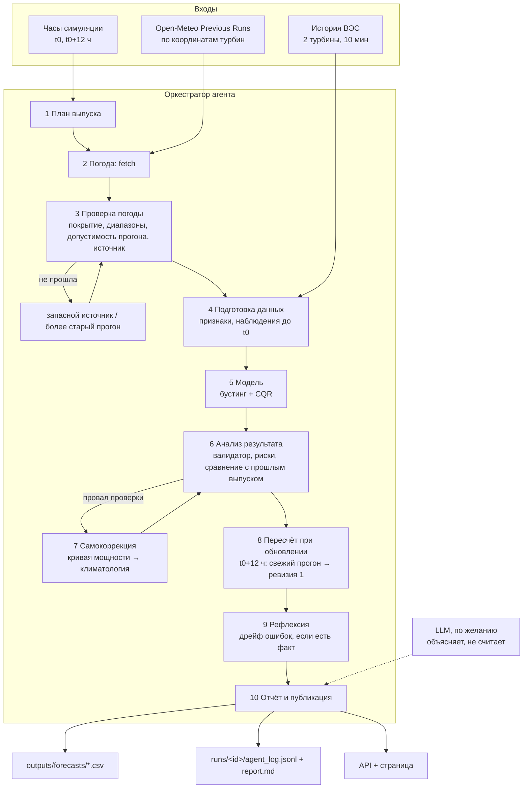

# WindCast Agent — решение, архитектура и логика

Кейс «Agentic AI для прогнозирования выработки ВЭС» (трек «Энергетика», кейсодатель АО «Самрук-Казына»). Документ — единый источник правды для команды CtrlX и для аудита. Контракт кода — `app/schemas.py` и `app/config.py`, требования и R-ID — `docs/REQUIREMENTS.md`.

**Как читать.** Каждое число помечено источником: **[R]** — посчитано кодом этого репозитория (`outputs/metrics/*.json`, команда `evaluate`), **[E]** — предварительный эксперимент на наших данных (скрипты вне репозитория, цифры в пределах шума ±0,004 от [R]), **[Д]** — документ или статья, прочитанные командой, **[Г]** — гипотеза или допущение. Раздел 15 — статус реализации на момент написания: что уже в репозитории, а что только спроектировано.

---

## 1. Суть в одном абзаце

Мы строим агента, который каждый день тестового периода «просыпается» в конце суток D, как дежурный диспетчер ВЭС, и выпускает почасовой прогноз выработки на следующие 48 часов. Погоду он берёт сам, по координатам станции, из открытого архива прогнозов Open-Meteo, и только те прогоны погодных моделей, которые **уже были опубликованы** к моменту выпуска. Это доказывается правилом, тестом и отметкой в каждой строке прогноза. Числа считают проверенные модели: градиентный бустинг (HistGradientBoosting из scikit-learn) с калиброванным коридором p10–p90, а запасная модель — кривая мощности. Агент проверяет входы и выход, переключается на запасные варианты, пересчитывает прогноз, когда выходит более свежий прогон погоды, и объясняет диспетчеру по-русски, что изменилось и насколько прогнозу можно верить. Каждое решение агента записано с причиной, а его польза измерена на январе 2026, где факт известен.

---

## 2. Что требует ТЗ и как мы это закрываем

| Требование ТЗ | Наша реализация | Как проверить |
|---|---|---|
| Модель почасовой выработки по историческим данным (03.2023 – 31.01.2026) | градиентный бустинг (медиана + квантили) поверх кривой мощности, обучение на симуляции выпусков по тем же правилам, что и в тесте (раздел 7) | `uv run python -m app.cli train`, `evaluate --holdout 2026-01` |
| Самостоятельно получает по координатам ВЭС из открытых источников прогнозы, доступные на момент прогноза | Open-Meteo Previous Runs API по координатам **обеих** турбин; живой запрос с офлайн-кэшем в репозитории; правило допустимости прогона (раздел 5, 6) | шаг `fetch_weather` в логе, `data/weather_cache/meta.json`, `tests/test_weather.py` |
| Прогноз на следующие 24–48 часов с почасовой детализацией | 48 часов: сутки D+1 (опережение 0–23 ч) и сутки D+2 (24–47 ч), по турбинам и по станции, с коридором p10–p90 | `outputs/forecasts/issue_*.csv` |
| Agentic AI: погода → подготовка → модель → прогноз → анализ → пересчёт при обновлении входных данных | Оркестратор с инструментами, проверками, развилками и журналом решений; пересчёт (ревизия 1) при появлении более свежего прогона (раздел 8) | `runs/<run_id>/agent_log.jsonl`, страница платформы |
| Воспроизвести как в прошлом: на 31.01, на 01.02 и далее последовательно | Команда `backtest`: 28 выпусков D = 31.01 … 27.02, каждый видит только то, что было доступно на его момент | `uv run python -m app.cli backtest`, `outputs/forecasts/february_2026.csv` |
| Архивные прогнозы, доступные на момент, а не фактическая погода | Не используем реанализ (ERA5), Historical Forecast API и «свежее» поле без суффикса; только `previous_dayN` с запасом на публикацию | тест утечки на каждую строку, колонка `wx_field` |

**Критерии оценки ТЗ:** соответствие и работоспособность 25, техническая реализация (включая agentic AI и соответствие реализации заявленной логике) 25, README и воспроизводимость 25, ценность и применимость 15, потенциал и оригинальность 10. Карта «критерий → чем берём → как эксперт проверит» — раздел 13.

---

## 3. Объект, пользователь и ценность

### 3.1. Какая это станция
Координаты из ТЗ совпадают с двумя турбинами ВЭС **«Нурлы»** (Енбекшиказахский район) с точностью 8,7 и 9,7 м по OpenStreetMap (relation 14072944) **[Д]**. Это станция 5 МВт: 2 × Goldwind GW109/2500, башня 80 м, ротор 109 м, введена 20.07.2020, около 15–16 млн кВт·ч в год **[Д: samruk-green.kz, OSM, thewindpower]**. Владелец — ТОО «Samruk-Green Energy», 100 % дочка АО «Самрук-Энерго». Значит, две турбины из данных — это вся станция, а прогноз «по станции» — это прогноз отпуска всей ВЭС в сеть.

### 3.2. Как это устроено на рынке Казахстана
- ВИЭ подаёт почасовую заявку планового отпуска в сеть на операционные сутки **до 08:00 по времени Астаны за сутки до них**; системный оператор утверждает суточный график до 16:00 **[Д: Правила оптового рынка, приказ МЭ № 106, п. 51, 68, 87, 96]**.
- ВИЭ с договором с единым закупщиком может корректировать план внутри суток **не позднее чем за 2 часа до часа** **[Д: там же, п. 97–99]**. Наш пересчёт при обновлении погоды (ревизия 1) — это ровно такая корректировка.
- Балансирующий рынок работает с июля 2023. Для договоров ВИЭ, заключённых с 13.04.2025, дисбаланс вне коридора ±5 % от плана часа оплачивается с коэффициентами 1,3 и 0,7, то есть штраф около 0,3 × цены на каждый кВт·ч **[Д: Правила БР, приказ № 112, п. 132, ред. 28.04.2026]**. Для старых договоров с РФЦ коэффициенты равны 1, и убыток балансирования ложится на систему: у РФЦ −2,15 млрд тг за 2024 год **[Д: inbusiness.kz]**.
- При симметричных коэффициентах 1,3 и 0,7 оптимальная заявка по ожидаемой стоимости — **медиана** прогноза. Поэтому точечный прогноз у нас — медиана (p50), а p10 и p90 показывают риск.
- **Как выпуск ложится на регламент.** Выпуск делается в полночь D+1 по итогам дня D. Его вторые сутки (D+2, опережение 24–47 ч) — это черновик суточной заявки, которую надо подать до 08:00 D+1: к дедлайну она готова с запасом в 8 часов. Первые сутки (D+1) — оперативный план текущих суток. Пересчёт в 12:00 D+1 корректирует часы D+1 не раньше 14:00, то есть не позже чем за 2 часа до часа, как требует п. 97–99. Контракт выпуска для этого менять не нужно.

### 3.3. Пользователь и сценарий
Диспетчер или специалист по планированию «Samruk-Green Energy» / «Самрук-Энерго». Каждый день он получает почасовой план на двое суток, коридор неопределённости, список рисков (резкие изменения, штиль, холод, низкое доверие) и объяснение, что изменилось с прошлого выпуска. Внутри суток, если вышел более свежий прогноз погоды, агент сам пересчитывает оставшиеся часы и показывает, что именно сдвинулось.

### 3.4. Ценность в цифрах (честно)
- Цель «Самрук-Энерго» по пресс-релизу Минэнерго от 20.08.2026 — «повысить точность прогнозов генерации до 80 %», запуск ИИ-решения в конце 2026 года; метрика не определена **[Д: gov.kz, inform.kz]**. Если «точность» понимать как 1 − nMAE, наша модель даёт **84,5 %** на январе 2026 и **82,2 %** на феврале 2025, а наивный прогноз — 69 % и 66 % **[R]**. Мы всегда показываем формулу рядом с цифрой.
- Сценарная оценка для нового режима договоров (коридор ±5 %, штраф 0,3 × цена, цена 18,7–24,7 тг/кВт·ч): **1 процентный пункт nMAE стоит около 2,5–3,2 млн тг в год на 5 МВт, 30–39 млн тг на 60 МВт и 0,5–0,65 млрд тг на 1 ГВт** **[Д + расчёт]**. Формула: 0,01 × мощность × 8760 ч × 0,3 × цена. Переход с кривой мощности на градиентный бустинг снижает nMAE на 4 п. п. на январе 2026 и на 3 п. п. на феврале 2025 **[R]**.
- Для самой «Нурлы» прямой штраф может быть близок к нулю (режим её договора по открытым данным не установлен). Ценность масштабируется на новые проекты группы: ВЭС 1 ГВт с Masdar и ВЭС 1 ГВт с CPIH строятся по новым правилам **[Д]**. Решение не зависит от размера станции: координаты и история — единственные входы.

---

## 4. Данные: что мы о них знаем

Проверено pandas на полных файлах **[E]**.

| | Турбина 1 | Турбина 2 |
|---|---|---|
| Строк (шаг 10 мин) | 142 360 | 149 499 |
| Период | 11.03.2023 00:00 – 31.01.2026 23:50 | то же |
| Пропуски 10-минуток | 6,6 %, главная дыра 18.05–17.07.2024 | 1,9 %, все дыры ≤ 2 суток |
| Мощность (доля номинала) | 0…1, плато 0,99 при ветре > 11 м/с | 0…1, плато 0,97 |
| Простой (ветер > 5 м/с, мощность ≤ 0,01) | 0,8 % часов | 0,5 % часов |

- Корреляция ветра и мощности 0,94; турбины между собой: ветер 0,99, мощность 0,96. Цель прогноза — мощность станции (среднее двух турбин), плюс отдельно каждая турбина.
- Сезонность сильная: зима 0,45–0,52, лето 0,23–0,30; январь 2026 — 0,32, февраль 2025 — 0,35. Суточный ход слабый: 0,33 ночью, 0,40 днём.
- **Часовой пояс.** «Статистическое время» — фиксированный UTC+5 на всём периоде. Доказательство: фаза суточного хода температуры до и после 01.03.2024 сдвигается на +6 минут (95 % ДИ −1…+14), а при переходе часов UTC+6 → UTC+5 было бы +60 минут; последовательность 29.02 → 01.03 непрерывна; сдвиг с прогнозом погоды максимален при +5 ч **[E9]**. В коде: `DATA_TZ = Etc/GMT-5`, отображение — Asia/Almaty (в тестовом феврале тоже UTC+5).
- **Холод.** В декабре–феврале при температуре ниже 0 °C и ветре больше 5 м/с 5,5–7,4 % часов показывают мощность меньше половины ожидаемой; эффект сосредоточен при ветре 5–7 м/с и одновременен на обеих турбинах. Это смесь обледенения и других холодовых эффектов, потери 1,6–4,2 % энергии холодных часов **[E6]**. Мы показываем это как флаг риска, а не как «модуль обледенения».
- **Простои** на точность почти не влияют: исключение их из обучения меняет MAE не больше чем на 0,0005 **[E7]**. Оставляем флаг, но не заявляем это как улучшение.

---

## 5. Погода: откуда и как берётся

### 5.1. Источник
**Open-Meteo Previous Runs API** (`previous-runs-api.open-meteo.com`) — открытый бесплатный архив прогнозов погодных моделей в том виде, в каком они были выпущены. Ключ не нужен. Запрос идёт по координатам обеих турбин, ветер в м/с, время в UTC.

Поля: скорость ветра на 100 и 10 м (`previous_day1..3`), направление ветра на 100 м, температура на 2 м, порывы на 10 м (`previous_day2`).

### 5.2. Что значит `previous_dayN` — три независимых доказательства
1. **Документация:** «Requesting `temperature_2m_previous_day1` returns the value predicted 24 hours before valid time; `_previous_day2` returns 48 hours before» **[Д: open-meteo.com/en/docs/previous-runs-api]**.
2. **Исходный код Open-Meteo:** значение для часа T берётся из последнего прогона с инициализацией не позже T − 24·N ч; если прогон пропущен, остаётся более старый **[Д: OmFileSplitter.swift]**.
3. **Сверка с Single Runs API:** фактическое опережение `previous_day1` — 24–29 ч, `previous_day2` — 48–53 ч для ECMWF, ICON и GFS **[E]**.

### 5.3. Правило допустимости (против утечки будущего)
Прогон с инициализацией `init` мог использоваться в момент выпуска `t0`, только если `init + задержка публикации ≤ t0`. В журнале шаг проверки погоды пишет оценку по этому правилу: когда стал доступен самый свежий использованный прогон и какой запас до выпуска (обычно 6 ч). Это оценка по правилу, не измерение; точные времена инициализации даст Single Runs API (развитие). Измеренная задержка появления прогона в Open-Meteo: ECMWF IFS HRES 7,0 ч, IFS 0,25° 7,8 ч, GFS 5,5–6,5 ч, ICON 3,8 ч **[E: meta.json Open-Meteo]**. Принимаем **7 часов** (было 6: для IFS это граница с утечкой на минуты).

| Опережение часа от момента выпуска | Прогон, который берём | Почему безопасно |
|---|---|---|
| 0–16 ч | `previous_day1` (выпущен за сутки) | init ≤ T − 24 ч ≤ t0 − 8 ч |
| 17–40 ч | `previous_day2` (за двое суток) | init ≤ T − 48 ч ≤ t0 − 8 ч |
| 41–47 ч | `previous_day3` (за трое суток) | init ≤ T − 72 ч |

Формула в коде: `N = (lead + 7 − часы_после_выпуска) // 24 + 1`, ограничение 1…3 (`config.safe_previous_day`). Если нужного поля нет, берётся **более старый** прогон (больший N), никогда не более свежий. Каждая строка прогноза хранит `wx_field` (day1/day2/day3); тест проверяет правило на каждой строке.

### 5.4. Скрытая ловушка: смена источника внутри `best_match`
`best_match` для этой точки — не одна модель. До 30.09.2025 его `previous_day` на 100 % совпадает с ICON, с 01.10.2025 — с ECMWF IFS HRES (ECMWF открыл данные 1.10.2025); порывы и после октября берутся из ICON **[E]**. У IFS средний ветер на 100 м на 1,35 м/с ниже, чем у ICON (5,25 против 6,60 м/с при 6,43 м/с на гондоле) **[E]**. Модель, обученная на «ICON-эпохе», без поправки сдвигает прогноз мощности примерно на −0,09.

Что делаем: (1) признак `nwp_epoch` (0 — ICON, 1 — IFS) и признак «прогон какой давности» — модель учит разницу уровней (проверка показала нейтральный эффект, 0,1534 → 0,1528 **[E]**, поэтому это страховка, а не заявленное улучшение); (2) агент в шаге проверки погоды сравнивает средний ветер последних 30 дней с обучающим распределением и пишет в лог источник; (3) в следующей итерации — явные модели `ecmwf_ifs` и `icon_global` вместо `best_match` (раздел 14).

### 5.5. Вторая модель погоды
`gfs_seamless` — запасной источник, если основной не прошёл проверку, и индикатор расхождения. **Не смешиваем** его с основным: зимой GFS завышает ветер (смещение прогноза мощности +0,11…+0,14), бустинг с признаками GFS хуже (0,160 против 0,150 в январе 2026) **[E5, E10]**. Расхождение моделей почти не предсказывает ошибку, если учесть уровень ветра **[E5]**, поэтому показываем его как пометку «модели расходятся», а не как меру точности.

### 5.6. Офлайн и живой режимы
- **Офлайн (по умолчанию):** ответы API закоммичены в `data/weather_cache/` с URL, временем загрузки и sha256 в `meta.json`. Эксперт запускает без сети и получает те же цифры.
- **Живой (`--refresh`):** агент сам запрашивает у Open-Meteo окно выпуска (48 ч) по координатам обеих турбин, сверяет ответ с архивом и пишет в журнал решение `live_match` или `live_mismatch`; прогноз всё равно строится по архиву, чтобы результат воспроизводился. Без сети — решение `cache` с причиной. Пример: выпуск 10.02 — живой ответ совпал с архивом на всех 48 часах (`runs/live_check/`).

---

## 6. Честность во времени: как мы доказываем отсутствие утечки

Кейс прямо требует воспроизводить прошлое. Мы делаем это как свойство архитектуры, а не как аккуратность разработчика.

1. **Момент выпуска.** Выпуск «на день D» делается в t0 = D+1 00:00 по Алматы (UTC+5), по итогам всех наблюдений дня D до 23:50. Первые сутки прогноза — D+1, вторые — D+2.
2. **Наблюдения:** агент видит только часы до t0. В феврале 2026 факта нет, поэтому память агента «заморожена» на 31.01 — это пишется в лог.
3. **Погода:** только прогоны, допустимые по правилу 5.3 на момент t0 (или t0 + 12 ч для ревизии 1).
4. **Модели:** для тестового февраля обучены на данных строго до 01.02.2026 00:00. Для отложенной проверки (январь 2026, февраль 2025) — строго до начала периода.
5. **Доказательства в репозитории:** колонка `wx_field` в каждой строке; тест правила на каждой строке; поле `issue_time_utc` в каждой строке и в каждом шаге лога; три доказательства семантики в разделе 5.2; запрет на ERA5, Historical Forecast API и поле без суффикса записан в README.
6. **«Отравленный» тест.** Все недопустимые на момент выпуска поля погоды (более свежие `previous_dayN` и вспомогательные поля) подменяются на 999, все наблюдения после t0 — тоже. Прогноз модели на все 48 часов и персистентность обязаны остаться теми же. Отдельно тесты Амирхана кодируют в синтетической погоде номер прогона прямо в значение и проверяют по значениям, что селектор никогда не берёт более свежий прогон.
7. **Один путь кода для обучения и боя.** Обучающая выборка строится тем же селектором погоды «на момент выпуска», что и февральский прогноз, поэтому модель не видит в обучении более свежих прогнозов, чем получит в тесте.

---

## 7. Модели и метрики

### 7.1. Лестница моделей
| Уровень | Модель | Роль |
|---|---|---|
| 0 | Климатология (месяц × час) | нижняя граница, крайний запасной вариант |
| 1 | Персистентность (среднее последних 24 ч до t0) | эталон для skill score |
| 2 | Кривая мощности по прогнозному ветру, отдельно для day1/day2/day3 | физическая опора, запасная модель агента, признак для бустинга |
| 3 | **Градиентный бустинг** HistGradientBoosting (scikit-learn): медиана + квантили 0,1 и 0,9 + конформная калибровка (CQR) | основная модель |

### 7.2. Как обучаем
- **Симуляция выпусков:** для каждого дня истории строим выпуск по тем же правилам, что и в тесте (правило допустимости, опережение 0–47 ч), и получаем около 33 000 строк «выпуск × час». Так модель учится на тех же по свежести прогнозах, которые увидит в феврале.
- **Признаки:** ветер 100 м и его куб, ветер 10 м, сдвиг ветра (100/10 м), порывы, sin/cos направления, температура, 1/T как прокси плотности, sin/cos местного часа, месяц, опережение, поле (day1/2/3), `nwp_epoch`, выход кривой мощности.
- **Гиперпараметры** зафиксированы до проверки и не подбирались по тесту: learning_rate 0,03, 500 итераций, 15 листьев, минимум 50 наблюдений в листе.
- **Почему не LightGBM.** В экспериментах использовался LightGBM, но его колесо для macOS требует системную библиотеку libomp из Homebrew: на чистом Mac эксперта запуск упал бы на импорте. HistGradientBoosting — тот же класс алгоритма, его колесо несёт libomp с собой; точность та же в пределах шума (январь 2026: 0,1541 → 0,1553) **[R]**.
- **Коридор p10–p90:** квантили бустинга без калибровки покрывают 70–76 % случаев вместо 80 % **[E4]**. Калибровка CQR на последних 60 днях обучающего периода исправляет это: в коде репозитория покрытие 83,3 % (январь 2026) и 84,1 % (февраль 2025) при средней ширине 0,52 и 0,60 **[R]**.

### 7.3. Что показали проверки (MAE в долях номинала; nMAE = MAE × 100 %)
| Модель | Январь 2026 **[R]** | Февраль 2025 **[R]** | Помесячно, 17 месяцев **[E]** |
|---|---|---|---|
| Персистентность (среднее 24 ч до выпуска) | 0,307 | 0,339 | 0,328 |
| Климатология (месяц × час) | 0,304 | 0,327 | — |
| Кривая мощности | 0,195 | 0,207 | 0,208 |
| **Градиентный бустинг (медиана)** | **0,155** | **0,178** | **0,177** |

Команда: `uv run python -m app.cli evaluate --holdout 2026-01` (и `2025-02`); модель каждый раз обучается строго до начала месяца. Skill к персистентности — 49 % (январь 2026) и 48 % (февраль 2025). По горизонту на январе: сутки D+1 — 0,151, сутки D+2 — 0,160 **[R]**. Помесячная проверка за 17 месяцев сделана в эксперименте на LightGBM: бустинг лучше кривой мощности в 16 из 17 месяцев **[E]**.

### 7.4. Что не сработало (и мы это не заявляем)
- Смешивание GFS с основной моделью — хуже зимой **[E5]**.
- Автоматическое вычитание вчерашней ошибки («самообучение на лету») — вредит несмещённой модели: январь 2026 0,152 → 0,164; помогает только явно смещённой (февраль 2025 0,188 → 0,179) **[E8]**. Поэтому рефлексия у нас — детектор дрейфа с явным решением (раздел 8.4), а не тихая поправка.
- Очистка от простоев — эффект ≤ 0,0005 **[E7]**.

### 7.5. Метрики в отчёте
Команда `evaluate` считает для каждого отложенного месяца: MAE, RMSE, nMAE (доля номинала), bias, skill к персистентности и к кривой мощности — по горизонтам «сутки D+1», «сутки D+2» и в целом; покрытие и среднюю ширину коридора p10–p90; эффект пересчёта в 12:00 на тех же парах «выпуск × час»; долю часов, где отклонение от плана укладывается в ±5 %, ±20 % и ±30 % (коридоры Правил БР, п. 132, 90, 132-1); «точность» 1 − nMAE с явной формулой; оценку сверху стоимости дисбаланса в тенге для нового режима договоров. Для января 2026 на 5 МВт при цене 22,68 тг/кВт·ч, если все часы вне коридора: бустинг ≈ 3,9 млн тг в месяц, кривая мощности ≈ 4,9 млн, персистентность ≈ 7,8 млн **[R]**. Честная оговорка: для прогноза на сутки вперёд коридор ±5 % почти недостижим — в него попадает 7 % часов, в ±20 % — 23 %, в ±30 % — 31 % (январь 2026) **[R]**, поэтому ценность считается по объёму отклонений.

Пока не считаются и перенесены в развитие: pinball loss и CRPS, качество предупреждений (POD/FAR рамп, ошибка в часах «низкого доверия»), стоимость в трёх режимах договора.

---

## 8. Агент: архитектура и логика

### 8.1. Что мы называем агентом
По определению Anthropic (Building effective agents, 2024) и позиционной статье ATSF (arXiv 2602.01776) наш агент — **агентный контур прогнозирования**: восприятие → планирование → действие → анализ → рефлексия → память, с одним оркестратором и набором детерминированных инструментов. Мы сознательно не называем его «мультиагентной LLM-системой». Литература однозначна: числа прогноза должны считать проверенные модели, а LLM их не улучшает (Tan et al., NeurIPS 2024) и может выдумывать значения (arXiv 2607.04569, 2605.25141). Обзор MDPI Automation 2026 формулирует границу: агентный слой оправдан там, где нужны обработка исключений, динамическая последовательность шагов, контролируемый вызов инструментов и объяснения на фактах. Ровно это и делает наш агент.

### 8.2. Схема


### 8.3. Шаги, развилки и пороги
Пороги зафиксированы заранее и лежат в `app/config.py`; каждое решение пишется в журнал с полями `decision` и `reason`.

| # | Шаг (инструмент) | Что проверяет или делает | Возможные решения |
|---|---|---|---|
| 1 | План (`plan`) | момент выпуска, горизонт, доступные модели, есть ли свежие наблюдения | «факт есть до t0» или «факт заморожен на 31.01» |
| 2 | Погода (`fetch_weather`) | архив по координатам обеих турбин (одна ячейка сетки); при `--refresh` — живой запрос окна выпуска и сверка с архивом | `cache` / `live_match` / `live_mismatch` |
| 3 | Проверка погоды (`validate_weather`) | 48 из 48 часов, нет пропусков, ветер 0–40 м/с, каждый час из допустимого прогона (с оценкой, когда стал доступен самый свежий прогон), источник `best_match`, сдвиг среднего ветра больше 1 м/с | `proceed`; если провал — `older_run` (невозможные значения отброшены, берётся более старый прогон того же источника), затем `switch → gfs_seamless`, затем `climatology` |
| 4 | Подготовка (`prepare`) | признаки 48 часов, наблюдения только до t0, персистентность | — |
| 5 | Модель (`run_model`) | градиентный бустинг: медиана, p10, p90, CQR-сдвиг из последних 60 дней | — |
| 6 | Анализ (`analyze`) | значения в [0; 1], p10 ≤ p50 ≤ p90, нет «плоской линии» при сильном ветре, среднее расхождение с кривой мощности ≤ 0,25, ветер внутри обучающего диапазона; риски: рампы (\|Δ\| ≥ 0,3 за 3 ч), штиль (< 5 %), холод (температура −10…+1 °C при ветре 5–8 м/с), широкий коридор, расхождение погодных моделей; сравнение первых 24 ч с часами 24–47 прошлого выпуска | `accept` или `fallback` |
| 7 | Самокоррекция | при провале — кривая мощности, затем климатология; не больше 2 попыток | модель в `model_name`, флаг `fallback_used` |
| 8 | Пересчёт (`recompute_if_updated`) | в t0 + 12 ч для часов с опережением ≥ 14 ч (корректировка не позже чем за 2 ч до часа) доступны более свежие прогоны; если поле погоды поменялось хотя бы у одного часа — пересчёт, но ревизия 1 публикуется только после тех же проверок погоды и прогноза; изменение «существенное», если среднее \|Δ\| > 0,05 или какой-то час > 0,2 | `recompute` → ревизия 1 / `keep_revision_0` / `no_update` |
| 9 | Рефлексия (`reflect`) | сравнивает свои опубликованные выпуски с фактом, который уже известен: средняя ошибка за 7 дней и её t-статистика; при \|t\| > 2 — флаг дрейфа и рекомендация переобучения; модель не меняется молча | `drift` / `ok` / `no_facts` / `frozen` (в феврале) |
| 10 | Отчёт (`write_report`) | CSV по контракту, `report.md` (сводка диспетчеру), журнал | — |

### 8.4. Память и рефлексия
- **Короткая память** — состояние выпуска (выбранные поля погоды, модель, проверки, риски); каждый шаг пишет в журнал свои аргументы и результат.
- **Длинная память** — прошлые выпуски в `outputs/forecasts/` и журналы в `runs/`. Без факта агент всё равно использует её: сравнивает новый выпуск с предыдущим на общих 24 часах и объясняет, что изменилось.
- **Рефлексия с фактом** работает только там, где факт действительно известен, — в реплее января 2026. Эксперимент показал, что автоматическая поправка на вчерашнюю ошибку вредит **[E8]**, поэтому агент не правит прогноз молча: он поднимает флаг дрейфа и рекомендует переобучение. Автоматическая замена модели по схеме champion / challenger — в развитии. Переобучение с последним месяцем данных дало 0,188 → 0,176 на феврале 2025 **[E8]**.

### 8.5. Роль LLM и её границы
- **Без ключа** всё работает: оркестратор детерминирован, сводка собирается из шаблона.
- **С ключом** (OpenAI-совместимый клиент, в том числе NVIDIA NIM): LLM получает только посчитанные факты (агрегаты, флаги, решения агента) и пишет сводку диспетчеру по-русски и объяснение «что изменилось и почему».
- **LLM не делает:** значения прогноза, квантили, метрики, пороги; не обходит правило утечки.
- **Проверка привязки чисел:** все числа из текста LLM сверяются с фактами выпуска; если есть лишнее число — берётся шаблонная сводка, в журнал пишется `llm_rejected: ungrounded number`.
- При наличии ключа реальный прогон с LLM сохраняется командой `uv run python -m app.cli forecast --issue 2026-02-01 --llm --demo-dir runs/llm_demo`, чтобы эксперт без ключа увидел результат.

### 8.6. Два режима работы
| | Реплей января 2026 | Тест: февраль 2026 |
|---|---|---|
| Факт после выпуска | есть (приходит день за днём) | нет |
| Модели | обучены до 01.01.2026 | обучены до 01.02.2026 |
| Рефлексия | считает ошибки, флаг дрейфа | заморожена, пишет «факт до 31.01» |
| Зачем | доказать пользу каждого решения агента числами | сдаваемый результат |

---

## 9. Как доказываем, что агент — не обёртка

Всё ниже посчитано кодом репозитория **[R]** и воспроизводится командами:
```
uv run python -m app.cli replay --month 2026-01   # → outputs/evidence/replay_2026-01.json
uv run python -m app.cli faults                   # → outputs/evidence/faults.json
```

1. **Журнал решений.** Каждый шаг — строка JSONL с временем, инструментом, статусом, решением и причиной; формат `AgentStep` в `app/schemas.py`.
2. **Реплей января 2026.** Тот же агент заново проживает месяц, где факт известен: модель обучена строго до 01.01.2026, факт приходит день за днём, 31 выпуск.

   | Вариант | MAE, январь 2026 |
   |---|---|
   | A. Персистентность (среднее последних 24 ч) | 0,307 |
   | B. Фиксированный конвейер: кривая мощности, без проверок и пересчёта | 0,195 |
   | C. Только модель: бустинг в момент выпуска, без пересчёта | 0,155 |
   | **D. Агент: проверки, запасные ветки, пересчёт в 12:00 (опубликованный план)** | **0,151** |

3. **Бухгалтерия решений с доверительным интервалом** (отрицательный эффект — ошибка уменьшилась по факту; 95 % интервал — бутстрэп по выпускам):

   | Что сравниваем | Сработало | Средний эффект на MAE | 95 % интервал | Выпусков в плюс |
   |---|---|---|---|---|
   | Основная модель против запасной (C против B) — проектный выбор, агент оставил бустинг во всех выпусках | 31 | −0,040 | −0,056 … −0,024 | 23 из 31 |
   | Решение агента: пересчёт в 12:00 по более свежему прогону | 31 | −0,006 | −0,015 … +0,002 | 19 из 31 |
   | Решения агента: откат на старый прогон, смена источника, запасная модель, флаг дрейфа | 0 | — | — | — |

   Честный вывод: польза модели доказана; собственный вклад агентного слоя в спокойном январе — пересчёт (в среднем помогает, но на одном месяце не значим), а главная ценность агентного слоя — устойчивость: запасные ветки проверяет следующий пункт.
4. **Отказоустойчивость.** Выпуск 9 февраля с намеренно испорченными входами:

   | Сбой | Агент | Фиксированный конвейер |
   |---|---|---|
   | 6 ч ветра нет в основном источнике | 48/48 ч: переход на `gfs_seamless` с причиной | 42/48 ч, 6 ч пустые |
   | Ветер 100 м/с во всех прогонах основного источника | 48/48 ч: переход на `gfs_seamless` | 48 ч, из них 6 ч построены по мусору без предупреждения |
   | Ветер 100 м/с только в самом свежем прогоне | 48/48 ч: `older_run` — более старый прогон того же источника, модель остаётся основной | 48 ч, из них 6 ч по мусору |
   | Основной источник недоступен | 48/48 ч: переход на `gfs_seamless` | 0 ч |
   | Оба источника сломаны | 48/48 ч: климатология с предупреждением | 42/48 ч |

   Этот тест нашёл и две ошибки самого агента (падение при пустом источнике и при полном отсутствии погоды) — обе исправлены до публикации.
5. **Тесты:** правило утечки на каждой строке, «отравленный» тест (раздел 6), совпадение двух реализаций выбора погоды, детерминизм (два запуска дают побайтно одинаковый CSV), полный набор шагов агента в журнале.

## 10. Что получает пользователь

- **`outputs/forecasts/issue_YYYY-MM-DD.csv`** — 48 часов (ревизия 0) плюс пересчитанные часы (ревизия 1); колонки: время выпуска и цели (UTC и местное), опережение, сутки, ревизия, мощность турбины 1, турбины 2 и станции, p10, p90, прогнозный ветер, поле погоды, модель погоды, модель прогноза, флаг запасного варианта, run_id.
- **`outputs/forecasts/february_2026.csv`** — сшитый ряд на весь февраль: для каждого часа последняя действующая ревизия выпуска, который покрывает этот час с наименьшим опережением; плюс отдельная колонка «прогноз на сутки вперёд» (из выпуска D−1) для сравнения с фактом организаторами.
- **Сводка диспетчеру** (`report.md`): средняя и пиковая выработка по суткам, в долях и в МВт (номинал 5 МВт), часы штиля, рампы, холодовой риск, ширина коридора, что изменилось с прошлого выпуска и после пересчёта.
- **Черновик суточной заявки** на D+2: 24 значения планового отпуска в МВт·ч по времени Астаны — формат, в котором ВИЭ подаёт заявку до 08:00.
- **Метрики** (`outputs/metrics/*.json`): отложенные проверки январь 2026 и февраль 2025 по моделям и горизонтам.
- **Платформа** (FastAPI + одна страница): выбор выпуска, график станции/турбин с коридором p10–p90 и заливкой по свежести погоды, ревизия 0 пунктиром и ревизия 1 сплошной, лента шагов агента по-русски с решениями, сводка, таблица метрик.

---

## 11. Технологии

Python 3.12, uv, pandas, pyarrow, scikit-learn (HistGradientBoosting), FastAPI, pydantic, pytest, ruff; OpenAI-совместимый клиент для необязательного LLM. Страница — одна HTML-страница с инлайновым SVG, без сборки и без внешних запросов. Всё работает на обычном ноутбуке без GPU, без ключей и без сети (офлайн-кэш). Контракт — `app/schemas.py`; конфиг и правило утечки — `app/config.py`.

Структура: `app/data.py` (история), `app/weather.py` (погода), `app/features.py` и `app/models.py` (признаки и модели), `app/train.py` и `app/evaluate.py` (обучение и проверки), `app/agent/` (оркестратор, инструменты, журнал, LLM), `app/api/` и `static/` (платформа), `app/cli.py` (команды).

---

## 12. Чем решение отличается от типового

| Вопрос | Типовое решение на хакатоне | WindCast Agent |
|---|---|---|
| Какая погода в тесте | «историческая» погода или реанализ, то есть факт, известный позже | только прогоны, опубликованные до выпуска; правило, тест, отметка в каждой строке |
| Знание источника | «Open-Meteo» как чёрный ящик | измерены задержки публикации, найдена смена модели внутри `best_match` 01.10.2025 |
| Агентность | LLM пишет текст поверх одного вызова модели | развилки с порогами, запасные ветки, пересчёт при свежем прогоне, журнал решений и измеренный эффект |
| Неопределённость | одна линия | p10–p90 с конформной калибровкой, проверенное покрытие 83–84 % при цели 80 % |
| Честность метрик | «точность 90 %» без формулы | MAE, RMSE, skill к двум эталонам, формула «1 − nMAE», что не сработало — тоже в отчёте |
| Связь с практикой | абстрактный прогноз | заявка на сутки вперёд до 08:00, корректировка за 2 ч до часа, коридор ±5 % балансирующего рынка, конкретная станция «Нурлы» |
| Воспроизводимость | нужен ключ API или сеть | три команды без ключей и сети; кэш и sha256 в репозитории |

---

## 13. Карта критериев

| Критерий | Баллы | Чем берём | Как эксперт проверит за 3 минуты |
|---|---|---|---|
| Соответствие и работоспособность | 25 | все пункты ТЗ из раздела 2; 28 выпусков одной командой | `uv sync && uv run python -m app.cli backtest` → 28 файлов и `february_2026.csv` |
| Техническая реализация | 25 | архитектура раздела 8, журнал решений, измеренный эффект, отказоустойчивость, тесты утечки | открыть `runs/<id>/agent_log.jsonl`, `uv run pytest -q` |
| README и воспроизводимость | 25 | три команды без ключей и сети, кэш и sha256, раздел «Как проверить за 3 минуты», smoke со свежего клона | README → команды → страница `http://localhost:8000` |
| Ценность и применимость | 15 | черновик заявки на D+2 в МВт·ч, риски, пересчёт как внутрисуточная корректировка, сценарная стоимость в тенге | сводка диспетчеру и таблица метрик в README |
| Потенциал и оригинальность | 10 | доказуемая честность во времени, найденная смена источника, пересчёт при новом прогоне, путь к ВЭС 1 ГВт | раздел README «Развитие» |

---

## 14. Объём работ: что делаем до фриза 16:30 и что в развитии

### P0 — обязательно к 16:30
| Кто | Что | Статус |
|---|---|---|
| Мустафа | история `app/data.py`, признаки, кривая мощности по полям, бустинг медиана + квантили + CQR, `train`, `evaluate` (январь 2026, февраль 2025) | готово (e58558a, e06a89b) |
| Мустафа | оркестратор с шагами 1–10 и развилками раздела 8.3, `backtest` на 28 выпусков за 4 с, `february_2026.csv`, задержка 7 ч | готово (5e77b12) |
| Мустафа | «отравленный» тест утечки, тест детерминизма, совпадение двух реализаций выбора погоды (`tests/test_agent.py`) | готово |
| Ансар | правки страницы (коридор без разрыва, ревизии, шаги по-русски, строка источника погоды), таблица метрик из `outputs/metrics`, README с разделом «Как проверить за 3 минуты», smoke | в работе |
| Амирхан | погода по координатам обеих турбин, живой запрос окна выпуска со сверкой с кэшем; тесты под задержку 7 ч | в работе |

**Порядок срезания при отставании** (вывод судьи): сначала LLM-сводка, затем отказоустойчивость, затем часть предупреждений, затем CQR. Никогда не срезаем: задержку 7 ч и тест утечки, 28 выпусков и `february_2026.csv`, проверку на январе 2026 против эталонов, README из трёх команд.

### P1 — если P0 готов к 15:50
- Реплей января 2026 с фактом, рефлексия с флагом дрейфа, бухгалтерия решений `decisions_2026-01.json` (Мустафа).
- Метрики коридоров ±5/20/30 %, стоимость в тенге, качество предупреждений (POD/FAR рамп) (Мустафа, таблица в README — Ансар).
- Абляция и отказоустойчивость одной командой (Мустафа), таблица в README (Ансар).
- Сводка LLM с проверкой привязки чисел и коммит `runs/llm_demo/` (Мустафа, ключ от Мустафы).
- Флаги рисков как отдельный модуль (Амирхан), идеи в `docs/IDEAS.md`.
- Режим «заявка до 08:00»: тот же агент с выпуском в D 08:00 и метрика «цена раннего дедлайна» (Мустафа).

### Развитие (в README как roadmap, не заявляем как сделанное)
- Явные модели `ecmwf_ifs` и `icon_global` и точные времена инициализации через Single Runs API; взвешенная комбинация NWP (в литературе до 9–17 % выигрыша, у нас на зиме не подтвердилось).
- Онлайн-калибровка коридора (ACI), влажность и осадки для флага обледенения по методике IEA Task 19.
- Живой режим: запуск по расписанию в 07:00 по Астане, выгрузка заявки в систему балансирующего рынка, внутрисуточные корректировки по новым прогонам.
- Масштаб: ВЭС 1 ГВт «Самрук-Энерго» и Masdar, парк станций с одним агентом на станцию; лицензия данных — ECMWF open data (CC BY 4.0) или коммерческий план Open-Meteo (бесплатный API — только некоммерческий).
- Trading и накопители — только после появления цен и данных СНЭ.

---

## 15. Статус реализации (на 16:15, 23.09.2026)

| Компонент | Статус |
|---|---|
| Погода: архив best_match и gfs_seamless по координатам обеих турбин, правило допустимости, живая сверка окна выпуска, тесты по значениям (Амирхан) | в репозитории |
| История, модели, обучение, проверки на январе 2026 и феврале 2025 | в репозитории |
| Агент: 10 шагов, откат на старый прогон, смена источника, лестница моделей, пересчёт с проверками, самопроверка, сводка, черновик заявки в МВт·ч | в репозитории |
| `backtest`: 28 выпусков, `february_2026.csv` (672 часа), за ~5 с без ключей | в репозитории, побайтно воспроизводится на свежем клоне |
| Реплей января, бухгалтерия решений, 5 сценариев сбоев, живая сверка (`runs/live_check/`) | в репозитории |
| Тесты | 98 зелёных: утечка по строкам и по значениям, «отравленный» тест, детерминизм, API |
| API и страница (Ансар) | в репозитории, работают на реальных выпусках |
| Docker-образ | содержит модель и результаты |
| LLM-сводка с проверкой чисел и запасным провайдером | код в репозитории; реальный прогон — при наличии ключа |
| «Спросить агента» (Амирхан, Ансар) | контракт в `app/schemas.py`; реализация — если успевает до фриза |

## 16. Риски и неудобные вопросы жюри

| Вопрос или риск | Ответ |
|---|---|
| «Это не агент, а конвейер» | Развилки с порогами, запасные ветки, пересчёт по событию, журнал решений, измеренный эффект и тест отказоустойчивости. Мы честно называем это агентным контуром, а не мультиагентной LLM-системой (раздел 8.1). |
| «Есть ли утечка будущего?» | Правило с задержкой 7 ч, три доказательства семантики, тест на каждой строке, отметка поля погоды в каждой строке. |
| «Почему не ERA5 или Historical Forecast?» | Это факт или почти анализ, известный позже, — запрещено условием кейса. |
| «Почему точность 85 %, а не 95 %?» | 94–96 % — это прогнозы на час вперёд; для суток вперёд на одной станции суши ошибка nMAE 15–20 % — нормальный уровень в литературе; у нас 15,5 % на январе 2026. |
| «Как проверить февраль без факта?» | Организаторы сравнят `february_2026.csv` с фактом; мы даём проверку на январе 2026 и феврале 2025 той же процедурой. |
| «Что будет в продакшене?» | Запуск по расписанию, живой запрос погоды, заявка в МВт, пересчёт за 2 ч до часа, лицензия ECMWF open data. |
| Смена источника внутри `best_match` | Признак эпохи, проверка сдвига в агенте, в развитии — явные модели. |
| Запуск на чистом Mac эксперта | LightGBM заменён на HistGradientBoosting: системная libomp не нужна. |
| Open-Meteo недоступен у эксперта | Офлайн-кэш в репозитории по умолчанию. |

---

## 17. Вопросы организаторам (ответы → в README «Допущения»)
1. Выпуск «на 31 января» — это прогноз по итогам 31.01 на 01–02.02 (наш вариант) или утренняя заявка 31.01 на 01.02?
2. Будет ли сравнение с фактом за февраль, какой метрикой и в каком формате сдавать файл?
3. Установленная мощность в данных — 5 МВт («Нурлы»)?
4. Можно ли держать выданные CSV в публичном репозитории?
5. Засчитывается ли Open-Meteo Previous Runs как «архивные прогнозы, доступные на момент выпуска»?

---

## 18. Источники (прочитаны командой)
- ТЗ кейса: Google Doc кейсодателя (копия в `docs/TASK.md`).
- Open-Meteo: документация Previous Runs, Historical Forecast и Single Runs API; исходный код `OmFileSplitter.swift`, `ForecastapiController.swift`; `meta.json` моделей.
- Правила оптового рынка (приказ МЭ № 106, V1500010531), Правила централизованной покупки ВИЭ (№ 164, V1500010662), Правила балансирующего рынка (№ 112, V1500010532) — adilet.zan.kz.
- Минэнерго РК, 20.08.2026 (gov.kz news 1277384) и перепечатка inform.kz; inbusiness.kz (KEGOC, РФЦ, цены единого закупщика).
- Samruk-Green Energy (страница проекта ВЭС «Нурлы»), OpenStreetMap relation 14072944, thewindpower.net.
- Hasan et al., «Agentic AI in Wind Energy Systems», IEEE Access 14 (2026), DOI 10.1109/ACCESS.2026.3654529 — концепция, метрик прогноза нет.
- Jørgensen & Ma, «Towards Agentic Virtual Power Plants…», MDPI Automation 7(5):138 (2026) — рамка: где агентный слой оправдан.
- X-GridAgent (arXiv 2512.20789), Grid-Agent (arXiv 2508.05702) — паттерны «планировщик + валидатор с откатом».
- Tan et al., «Are Language Models Actually Useful for Time Series Forecasting?», NeurIPS 2024 (arXiv 2406.16964).
- Anthropic, «Building effective agents» (2024); ATSF position paper (arXiv 2602.01776).
- Romano, Patterson, Candès, CQR (arXiv 1905.03222); Nielsen et al. 2007, Wind Energy 10:471 (комбинация NWP); arXiv 2602.13010 (day-ahead для оффшорных ферм); IEA Wind Task 19 (обледенение).
- Прочитаны и признаны нерелевантными прогнозу ВЭС: IEEE 11415591 (MADRL для размещения BESS), IEEE 11404913 («load balancing accuracy 95,1 %», не точность прогноза). Ссылка vapress.kz — о наборе в молодёжный совет, к кейсу не относится.

**Чего мы не утверждаем:** «точность 80–95 %» и «снижение затрат на 30–50 %» из маркетинговых текстов ни одним прочитанным источником не подтверждаются, и мы их не используем.
